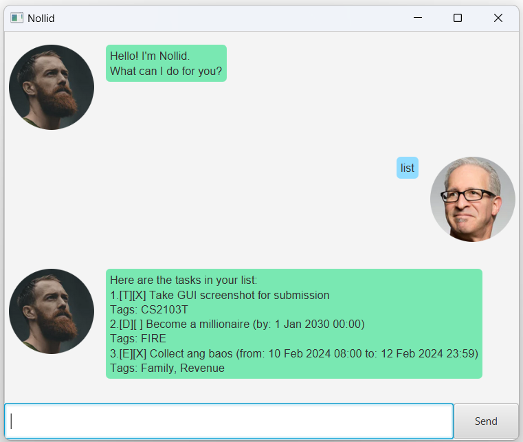

# Nollid User Guide

_**Nollid**. The future of productivity._

---

# Installation

1. Ensure you have Java 11 or above installed.

> [!TIP]
> 
> Execute the command `java --version` in your command prompt to check the version of Java you have!

test

2. Download the latest version of Nollid from [the releases page](https://github.com/dillontkh/ip/releases).
3. `cd` to the folder containing `Nollid.jar` and use `java -jar Nollid.jar` to start the application.

---

# Features 

## Viewing help: `help`

Shows a list of commands.

Format: `help`

## Adding to-do tasks: `todo`

Creates a new to-do task.

Format: `todo task_description.`

`task_description`: The description of the to-do task to be created.

> Example: `todo Buy some cheese`
> 
> Creates a new to-do task with the description "Buy some cheese".

## Adding deadlines: `deadline`

Creates a new deadline.

Format: `deadline task_description /by d/m/yyyy [hh:mm]`

`task_description`: The description of the deadline to be created.

`/by d/m/yyyy`: Option to specify deadline date in d/m/yyyy format.

`[hh:mm]`: [Optional] Specify deadline time in 24-hour format. If omitted, default time is set to 00:00.

> Example: `deadline Submit homework /by 12/2/2024 23:59`
>
> Creates a new deadline with the description "Submit homework" to be completed by 12 February 2024, 23:59.

## Adding events: `event`

Creates a new event.

Format: `event task_description /from d/m/yyyy [hh:mm] /to d/m/yyyy [hh:mm]`

`task_description`: The description of the event to be created.

`/from d/m/yyyy`: Option to specify start date of event in d/m/yyyy format.

`/to d/m/yyyy`: Option to specify end date of event in d/m/yyyy format.

`[hh:mm]`: [Optional] Time of the start/end of event in 24-hour format. If omitted, default time is set to 00:00.

> Example: `event Trip to Japan! /from 12/3/2024 /to 12/4/2024 18:00`
>
> Creates a new event with the description "Trip to Japan!" starting from 12 Mar 2024 00:00 to 12 Apr 2024 18:00.

## Using tags: `/tags`
You can also use the `/tags` option while adding any task to specify tags!

> Example: `todo Buy ketchup /tags groceries,chores,food`
> 
> Creates a new to-do task with the description "Buy ketchup" and the tags "groceries", "chores", and "food".

## List all tasks: `list`

Displays all tasks along with the following information:
- Completion status
- Deadline (for **Deadlines**)
- Start/End (for **Events**)
- Tags (if any)

Format: `list`

## Marking tasks as complete: `mark`

Marks a given task as complete.

Format: `mark index`

`index` - The index of the task to mark as complete, as shown in `list`.

> Example: `mark 1`
>
> Marks the first task in the list as complete.

## Marking task as incomplete: `unmark`

Marks a given task as incomplete.

Format: `unmark index`

`index` - The index of the task to mark as incomplete, as shown in `list`.

> Example: `unmark 1`
> 
> Marks the first task in the list as incomplete.

## Delete a task: `delete`

Deletes a given task from the list.

Format: `delete index`

`index` - The index of the task to delete, as shown in `list`.

> Example: `delete 1`
> 
> Deletes the first task in the list.

## Find a task: `find`

Finds a task whose description contains the given keyword.

Format: `find keyword`

`keyword` - The keyword to search for.

> Example: `find apple`
> 
> Returns tasks whose description contains the word "apple".
> 
> Output:
> 
> 1.[T][ ] Buy an apple
> 
> 2.[T][ ] Buy pineapples
> 
> Both tasks above will be returned in the search results as they contain "apple".

## Exit the application: `bye`

Exits the program.

Format: `bye`

## Saving data

Your tasks are automatically saved whenever the task list is updated.

No manual saving is required.

The save file can be found at `./data/nollid.json`